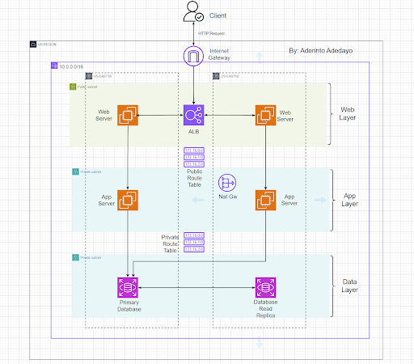
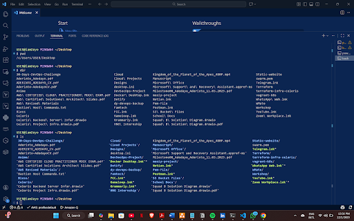

# Week 0 – Basic Understanding of Internet, Networking & Tools Basics
This week covers the fundamental concepts needed before diving deeper into DevOps.
Below are all the tasks, explanations, screenshots, and results I completed as part of the DevOps Micro Internship (DMI Cohort).

## Task 1: Using ChatGPT as Your Learning Assistant
Learn how to use ChatGPT effectively to understand technical concepts.

### What I Did: 
-   Created a clear prompt asking ChatGPT:
    “What is a protocol in networking? Explain with a simple real-life example.”
-   Explained expectations clearly in the prompt.
-   Received a simplified answer from ChatGPT.

### Screenshot of the ChatGPT response:


## Task 2: Internet & Networking Explanation
Given Scenario
Friend is launching an online bookstore EpicReads hosted in Finland.
I had to explain how users from anywhere (e.g., USA) can access the website.

### My Explanation:
-   Packet Switching
 Data is broken into small pieces called packets. Each packet can take different routes to reach the destination, and then they’re reassembled. This makes the internet fast and efficient.
-   IP Address
 An IP address is like a home address for devices. It tells the network where to deliver data. Every device online needs one.
-   TCP/IP
 TCP/IP is the core communication system of the Internet. IP handles addressing and routing. TCP makes sure the data arrives complete and in the right order.
-   HTTP/HTTPS
 These are rules your browser uses to load websites. HTTP transfers web pages. HTTPS does the same but encrypts everything for security. 


## Task 3: Application Architecture And Stack

### What I Did
-   Created diagrams showing:
-   Three-tier architecture: Frontend + Backend + Database
-   Labelled each layer.
-   Listed technologies used in each layer.

### Diagram of Three-Tier Architecture


### Technologies Used in Each Layer
-   Frontend: HTML, CSS, JavaScript, React
-   Backend: Node.js, Express.js
-   Database: MongoDB, MySQL

## Task 4: Domain Name And DNS (Basic Concepts)

### Explanation of Domain Name and DNS
DNS is the Internet’s phonebook. It converts human-friendly names like example.com into machine-friendly IP addresses like EpicReads IP Address 52.172.142.222:3000 so that browsers know where to connect.
To point a domain to an IP, you use an A record for IPv4 or an AAAA record for IPv6.
The A record is the most common because most servers still use IPv4, and it directly maps the domain to the server’s IP for fast, reliable routing.

### Task 5:Visual Studio Code Setup (Hands-on)


### What I Did
-   Installed VS Code.
-   Opened terminal inside VS Code.
-   Ran basic commands (dir, pwd, or ls).
-   Selected a theme.
-   Took a screenshot showing:
    -   Terminal
    -   Selected theme
    -   Visible user details

### Screenshot of VS Code Setup


### Task 6: LinkedIn Post

### What I Did
-   Summarized tasks 1–5.
-   Structured the post into sections.
-   Added the mandatory credit note.
-   Published on LinkedIn.
-   🔗 LinkedIn Post: [Post](https://www.linkedin.com/posts/aderinto-adedayo_youtube-activity-7401944542846959616-XwiJ?utm_source=share&utm_medium=member_desktop&rcm=ACoAADAHPe0BH68dCMpdUU3sKs7q5kNxV7FBDFU)


### Folder Structure
```
week-00-internet-networking-tools-basics/
├── README.md
└── images/
├── img1/
├── img2/
├── img3/
└── img4/
```


